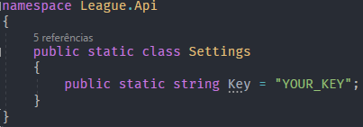

<h1 align="center"> League Project </h1>

## Install
1. Clone the repository
```
$ git clone  https://github.com/MarcosOlvr/LigaDasLendas.git
```

2. Access the folder
```
$ cd LigaDasLendas
```

3. Install .NET libraries
```
$ dotnet add package RiotSharp --version 4.0.0
```
```
$ dotnet add package Camille.RiotGames
```
```
$ dotnet add package Microsoft.AspNet.Cors
```

4. Install VueJs dependencies
```
$ npm i
```

# API EndPoints
You'll need a key to access the RIOT API. Go to https://developer.riotgames.com/apis and make your request.

Then create a file like this:


## Summoner 
* GET *api/summoner/summonerName*
* GET *api/masteries/summonerName*
* GET *api/icon/iconId*
* GET *api/league/summonerId*

## Champions
* GET *api/champ/{skip}/{take}*
* GET *api/champ/champId*
* GET *api/champ/champName*

## Matches
* GET *api/match/matchId*
* GET *api/match/latest/summonerPuuid*
* GET *api/item/itemId*
* GET *api/items?item1=Id&item2=Id&item3=Id&item4=Id&item5=Id&item6=Id*
