<h1 align="center"> League Project </h1>

<p align="center">Project based on the Riot Games API that retrieves data from the League of Legends game and transforms it into a website with information about the game.</p>

## Install
1. Clone the repository
```
$ git clone  https://github.com/MarcosOlvr/LigaDasLendas.git
```

2. Access the folder
```
$ cd LigaDasLendas
```

3. Install .NET libraries
```
$ dotnet add package RiotSharp
```
```
$ dotnet add package Camille.RiotGames
```
```
$ dotnet add package Microsoft.AspNet.Cors
```

4. Install VueJs dependencies
```
$ npm i
```

## Run the app
1. In League.Api folder:
```
$ dotnet watch run
```

2. In League.Web folder:
```
$ npm run dev
```

# API EndPoints
You'll need a key to access the RIOT API. Go to https://developer.riotgames.com/apis and make your request.

Then create a file like this:

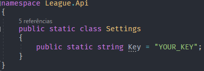

## Summoner 
* GET *api/summoner/summonerName-tagLine*
* GET *api/masteries/summonerName-tagLine*
* GET *api/icon/summonerName-tagLine*
* GET *api/league/summonerName-tagLine*
* GET *api/runes*
* GET *api/runes/runeName*
* GET *api/spells*

## Champions
* GET *api/champ/{skip}/{take}*
* GET *api/champ/champId*
* GET *api/champ/champName*

## Matches
* GET *api/match/latest/{riotId}-{tagLine}/*


# FrontEnd Pages 

### Home
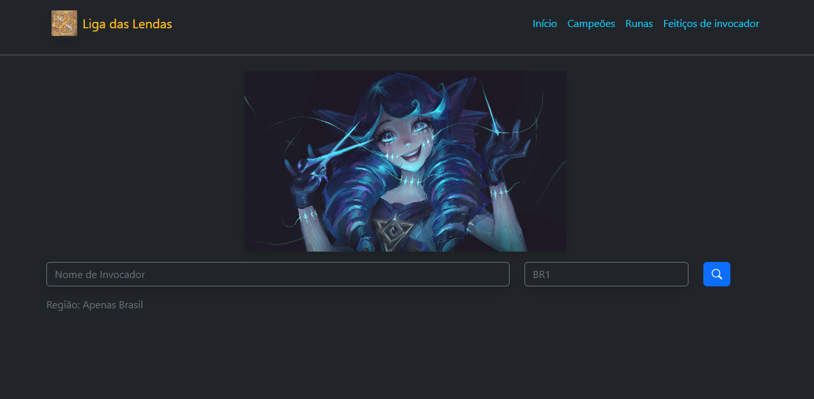
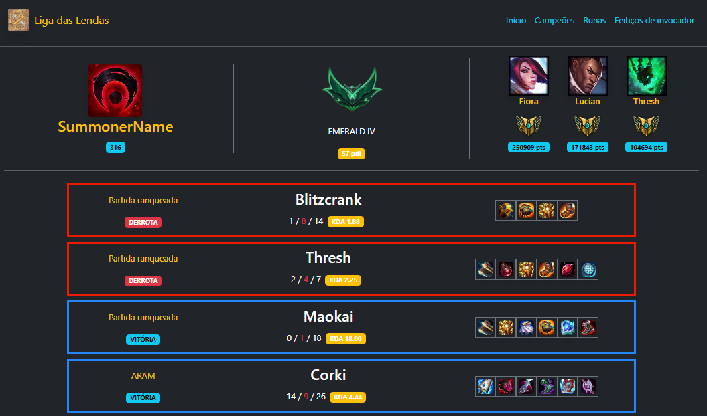

### Champions
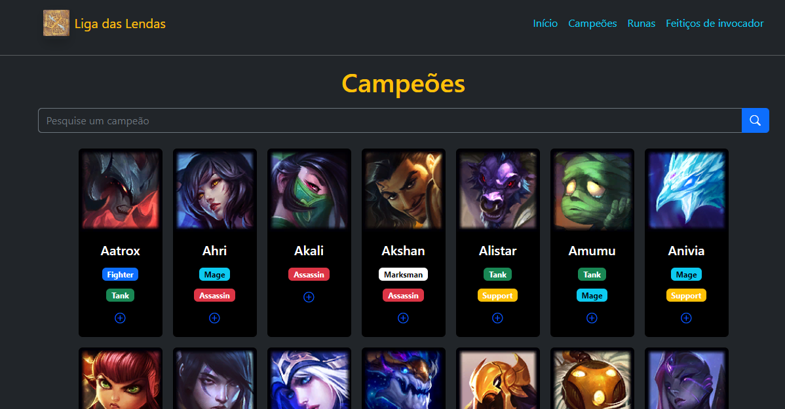

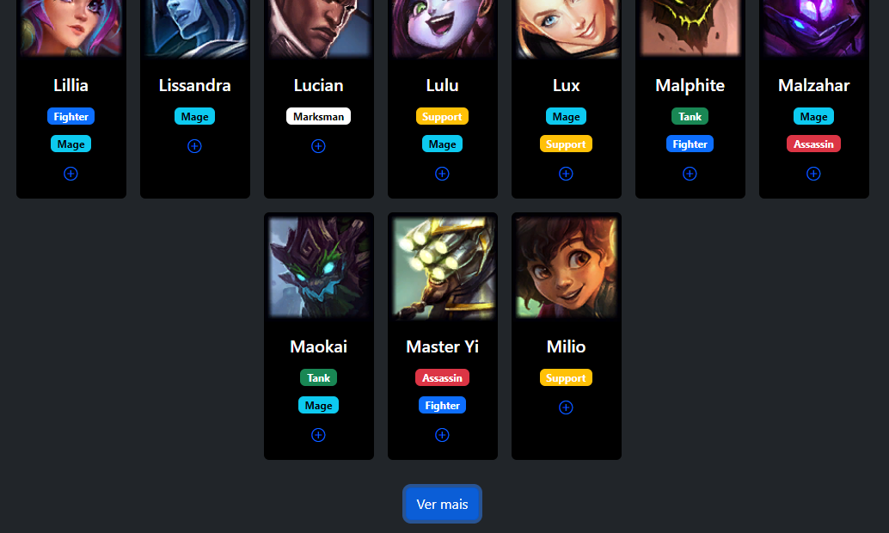

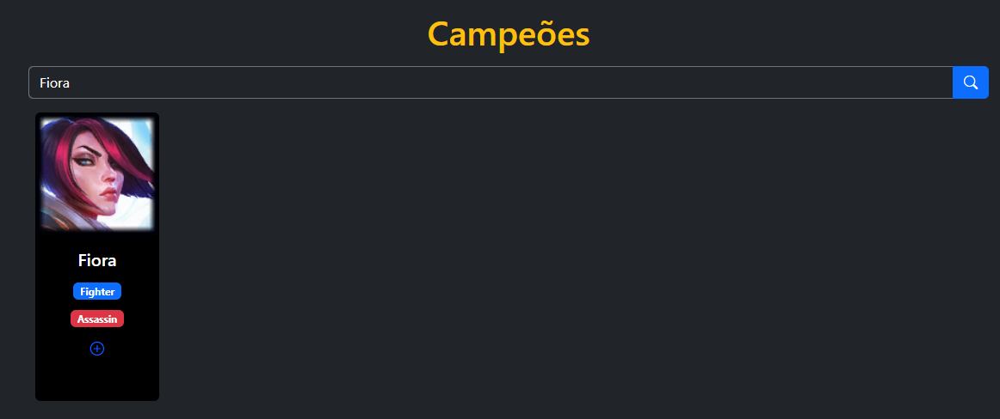

### Champion (Lucian)
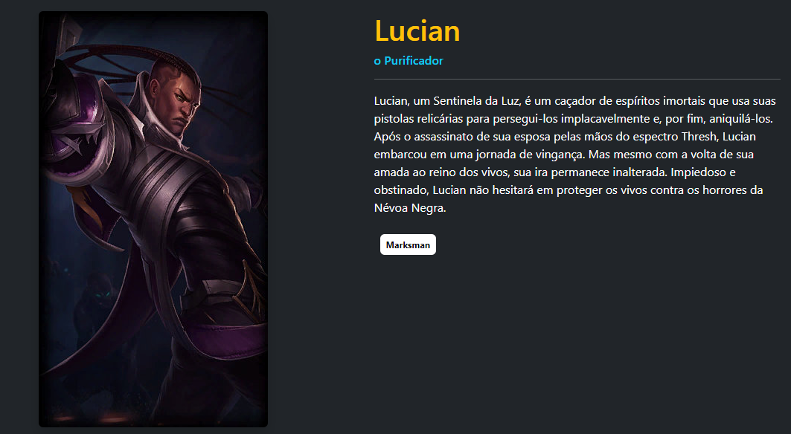
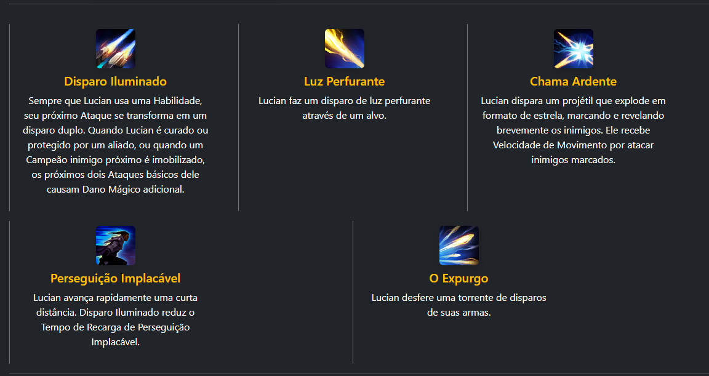
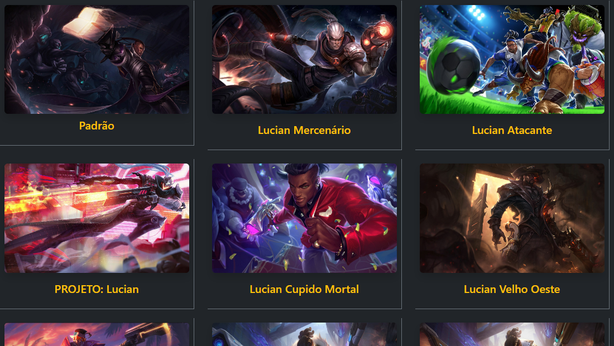

### Runes 
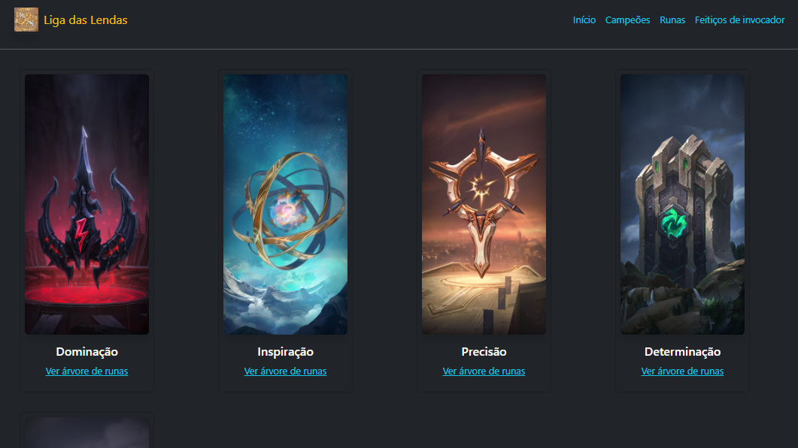

### Summoner Spells
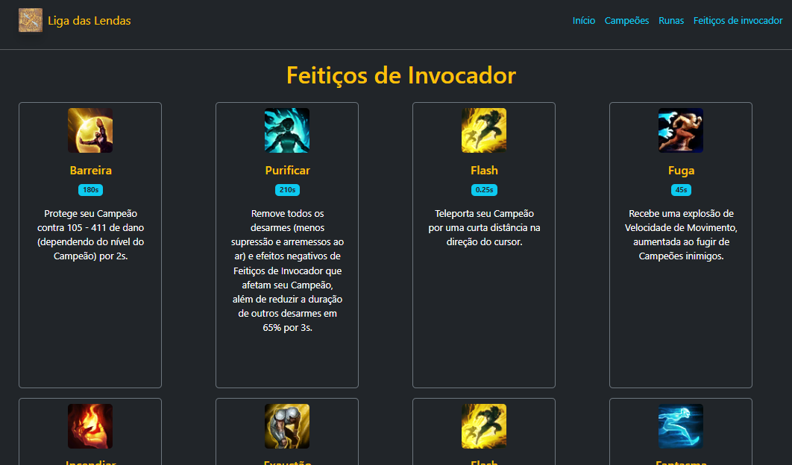